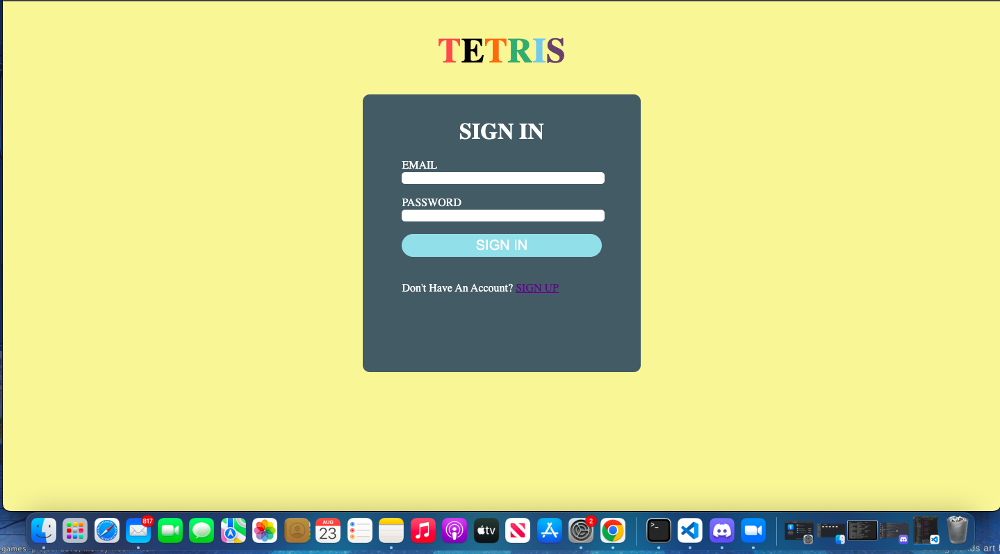
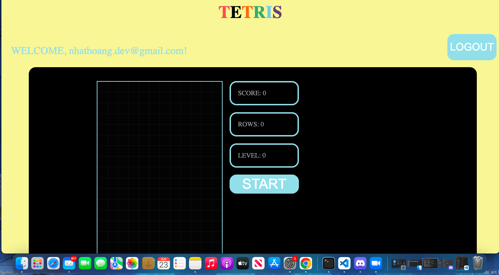
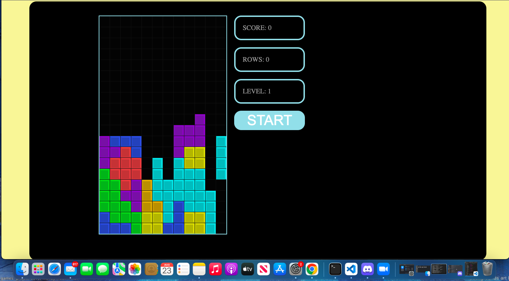
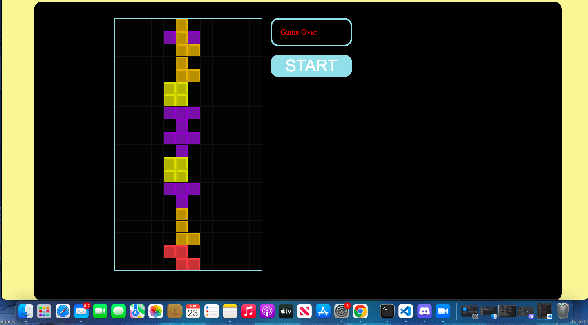

*"TETRIS"*
===========
Learn more about the developer: 

LinkedIn: https://www.linkedin.com/in/nhathoangdev/

Portfolio: https://nhoang1122.github.io/

Project Deployed On: https://tetris-specs.herokuapp.com/

*"TETRIS"* is a Full-Stack Game Application. Users sign in or register with an Email and a Password. User will then play the classic game TETRIS, using AWSD keys for movement.   

#### Technologies
React, Custom Hooks, CSS, FireBase

#### Version 2.0

###### ScoreBoard
In the future, I'd like to add a ScoreBoard DataBase to store ALL the users' scores and display the top 3. 

